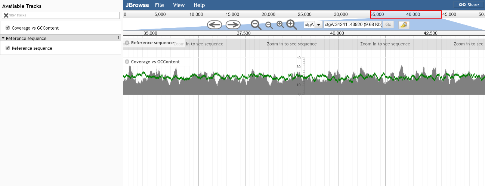

# gccoverage

A JBrowse plugin to view GC content overlaid on a BAM / BW coverage plot

## Introduction

It's known that GC content influences things like PCR and sequencing, so comparing a coverage plot with GC content can reveal interesting patterns. Reference http://merenlab.org/2016/12/14/coverage-variation/ 

## Screenshot

Green shows GC content as percentage of track height, grey is bam file coverage with y-axis scale. Note that this is just sample data, see meren lab blog post for more convincing applications

## Setup

This plugin will automatically calculate GCContent from the refseq track, and it will then have a configuration that takes a BAM or bigwig track as an accessory

Example configuration

    [tracks.gccoverage]
    key=Coverage vs GCContent
    storeClass = JBrowse/Store/SeqFeature/BAM
    type = GCCoverage/View/Track/GCCoverage
    urlTemplate = volvox-sorted.bam

## Installation

Download the repo to jbrowse plugins folder and name it GCCoverage. Then add to the your config file, e.g.

    "plugins": ["GCCoverage"]

See JBrowse FAQ for details on installing plugins

## Demo

The test/data directory contains an example config. View ?data=plugins/GCCoverage/test/data in your browser after installing

